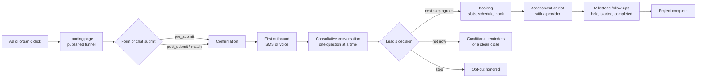
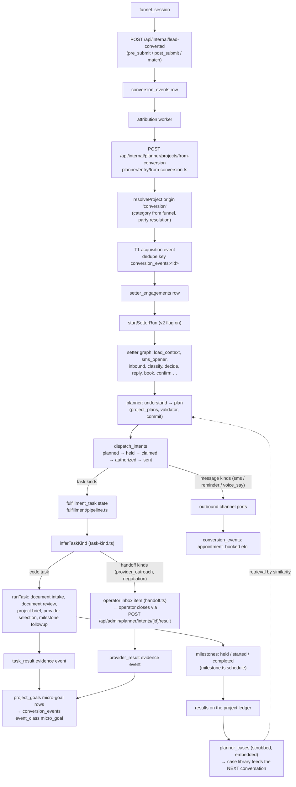
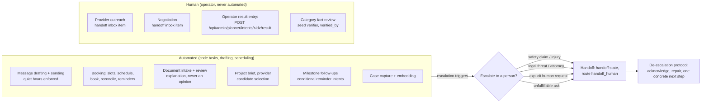

# Lifecycle map — the lead's journey through our engine

Four views of one spine. Every node in every diagram traces to a real route or module — nothing here is aspirational. The seams were verified in the worktree 2026-10-06; the testing runbook for the whole chain is [`agentic-testing.md`](./agentic-testing.md), and the design spec is `docs/superpowers/specs/2026-10-04-consultative-planner-design.md`.

## 1. USER FLOW — the lead's journey

| # | Seam | Implementing file / route |
|---|---|---|
| A→B | click → session on the published funnel | `packages/schema/src/schema/funnels.ts` (`published_funnels`, `funnel_sessions`; `session_id` carried on every later row) |
| B→C | LP form/chat submit → internal conversion event | `apps/dashboard/src/app/api/internal/lead-converted/route.ts` (event_type `pre_submit`/`post_submit`/`match`; `findOrCreateCustomer` by email → phone; profile resolution with confidence) |
| C→D | the conversion row the attribution worker claims | `conversion_events` (`packages/schema/src/schema/funnels.ts`), worker dispatch per `status='pending'` |
| D→E | the first outbound the lead receives | setter graph `sms_opener` / `voice_open` (`agents/definitions/setter_engagement.json`), started by `src/server/planner/entry/from-conversion.ts` → `startSetterRun` (`src/server/setter/graph/start.ts`) |
| E→F | the consultative conversation | setter graph states `inbound → classify → decide → reply` with the planner's `get_best_next_move` (one-question rule, permissions before action) |
| F→H | booking | `apps/dashboard/src/app/api/internal/funnel-booking/{slots,schedule,book,reconcile}/route.ts` + calendar providers; graph states `book → confirm`; `booking_confirm` implicit reason (`src/server/planner/tool-pack.ts` `IMPLICIT_REASONS`) |
| F→I | not-now / clean close | conditional reminder intents (`dispatch_intents` kind `reminder`, `milestone.ts` reminder schedule) or `closed` state |
| F→J | opt-out | graph state `record_opt_out` → `opted_out`; `communication_opt_outs` row (never deleted; TCPA auditability) |
| H→L | fulfillment and service | see diagram 3 |

## 2. JOURNEY MAP — per stage: the lead, the system, the metric

Grounded in the L5 UX constructs: speed-to-lead (FTL), one-question-at-a-time conversational pacing (T2G, DER), permission-before-action (trust), self-language echo (the lead hears their own words), and the perfect-outcome elicitation (the "job completion statement" the lead voices themselves).

| Stage | The lead is thinking / feeling | The system does (the seam) | The metric gate |
|---|---|---|---|
| Click → LP | "Is this relevant to me?" | serves the published funnel variant; opens the session | (marketing measurement, out of scope here) |
| Form/chat submit | "Will this be worth my contact info?" | writes the conversion row, resolves the profile by email→phone with a confidence score (`lead-converted/route.ts`) | submission success rate (worker scope) |
| Confirmation → first message | "Is anyone actually there? Is this a bot?" | attribution worker → from-conversion → first outbound on the lead's preferred channel (`from-conversion.ts`); opt-out line on the first message (`guard.ts` `stripOptOutLine` usage) | **FTL** — median ≤ 5 min |
| Early conversation | "Do they understand my problem, or are they reading a script?" | one question at a time; reflects the lead's words back before suggesting anything (understand step, `understand.v1.md`); earns channel + discovery permissions | **T2G** per goal; permissions granted before any action |
| Discovery → options | "Do they know roofs / my situation specifically?" | knowledge lookup scoped to the category (`setter/knowledge/`), options and tradeoffs explained, documents reviewed together | **DER** by question type; corpus coverage proxy ≥ 85% |
| Desire confirmation | "They said it back the way I said it." | the understanding records the lead's own outcome statement; later steps echo it verbatim (grounded check in the eval rubric) | `grounded` rubric check; reply-continuation rate |
| Booking | "This next step fits my situation." | slots offered, booked, confirmed; `booking_confirm` milestone; appointment row + micro-goal `appointment_booked` (`onAppointmentBooked`, `conversion-log.ts`) | booking step conversion in the micro-goal funnel |
| After the booking (visit, work) | "Did they forget about me the moment I signed?" | milestone follow-ups: held / started / completed, conditional reminders (`fulfillment/milestone.ts`) | milestone goal attainment; reply-continuation |
| Any stage — opt-out | "Stop contacting me." | recorded immediately, all channels, never deleted | **opt-out rate** ≤ 1%; angry revocation never treated as mere abuse |

## 3. PROCESS CHART — system POV

| Node | Implementing file / route |
|---|---|
| funnel_session | `packages/schema/src/schema/funnels.ts` |
| lead-converted | `apps/dashboard/src/app/api/internal/lead-converted/route.ts` |
| attribution worker | claims `conversion_events` rows `status='pending'`, `event_class='conversion'` (0269 header: the class filter is defence in depth) |
| from-conversion | `apps/dashboard/src/app/api/internal/planner/projects/from-conversion/route.ts` → `src/server/planner/entry/from-conversion.ts` (steps 1–5 in its header comment: op + conversion load, resolveProject, T1 acquisition event keyed `conversion_events:<id>`, one `setter_engagements` row, `startSetterRun` under the v2 flag; every step idempotent) |
| setter graph | `agents/definitions/setter_engagement.json` (seeded by `scripts/seed-agent-definitions.ts`), engine `src/server/agents/v2/` |
| understand / plan | `src/server/planner/understand.ts`, `plan-schema.ts`, committed via `src/server/planner/coordinator.ts` → `project_plans` (status `accepted`), validator `src/server/planner/validate.ts` |
| dispatch | `src/server/planner/dispatch.ts` (materialize → claim → authorize → `recordDispatchResult`); channel send via `src/server/channels/tools.ts` |
| fulfillment pipeline | `src/server/planner/fulfillment/pipeline.ts` (intent → TaskKind → code task or handoff; one transaction: evidence event + intent result) |
| task kinds | `src/server/planner/fulfillment/task-kind.ts`, contracts `capabilities.ts` (TASK_REGISTRY), tasks `document-intake.ts`, `document-review.ts`, `project-brief.ts`, `provider-selection.ts`, `milestone.ts` |
| handoff inbox | `src/server/planner/fulfillment/handoff.ts` (payload build, inbox open, intent `sent`); close: `POST /api/admin/planner/intents/[id]/result` → `provider_result` event |
| micro-goal rows | `src/server/planner/conversion-log.ts` (one `conversion_events` row per goal lifecycle change, `event_class='micro_goal'`, `event_type goal.<type>.<lifecycle>`, status `recorded`, never claimed) |
| booking | `apps/dashboard/src/app/api/internal/funnel-booking/` (`slots`, `schedule`, `book`, `reconcile`) + `src/server/setter/graph/booking.ts` (`onAppointmentBooked`) |
| milestones | `src/server/planner/fulfillment/milestone.ts` (`MILESTONES` held/started/completed; `milestoneSchedule` offsets: held +4 h, started +1 d, completed +2 d) |
| case library | `src/server/planner/cases.ts` (`writeCase`, scrubbed via `scrub.ts`, supersede per `(source_kind, source_id)`; embedding backoff ladder) → `planner_cases`, retrieval `src/server/planner/retrieval.ts` |

## 4. AUTOMATION MAP — what is automated, what is human

Verified in code, most importantly `fulfillment/handoff.ts`'s header: *"Contacting providers and negotiating are not automated: the contract is typed, the work is an operator's."*

| What | Automated? | The seam |
|---|---|---|
| Outbound drafting + sending | **Automated.** The planner drafts; the guard (`src/server/setter/graph/guard.ts`) enforces human-claim rules, opt-out line handling, claim classes; dispatch authorization is conditional (`dispatch.ts`) | `tool-pack.ts` `planner.authorize` + channel ports |
| Scheduling / booking | **Automated.** | `funnel-booking/` routes; `booking_confirm` implicit reason |
| Document intake / review | **Automated** — explanation, not opinion: the document prompt forbids inspecting, certifying a scope, or judging a price for a home it has not seen | `document-intake.ts`, `document-review.ts`, prompt `agents/planner/prompts/document-review.v1.md` |
| Project brief / provider selection | **Automated.** | `project-brief.ts`, `provider-selection.ts` |
| Provider outreach | **Human.** Typed handoff payload, operator inbox item (`planner_provider_outreach`), result route closes it | `handoff.ts`, `POST /api/admin/planner/intents/[id]/result` |
| Negotiation | **Human.** Never claimed as automated. | `handoff.ts` (`negotiation` kind) |
| Operator result entry | **Human.** | the result route writes the `provider_result` event, closes the intent, resolves the inbox item |
| Milestone follow-ups | **Automated** — the task never contacts anyone itself; it mints a conditional reminder the run's channel states send | `milestone.ts` |

**Escalation triggers** (the `handoff` action kind; graph state `handoff` → `handed_off`, route `handoff_human` in `tools.ts`):
- **Safety / injury claims** — anything suggesting danger on the property.
- **Legal threats** — attorneys, claims of liability.
- **Explicit human request** — "I want to talk to a person" (also the `human_claim` guard pattern in `guard.ts`).
- **Unfulfillable asks** — the planner's validator refuses; `decide` routes `handoff_human` when the plan's next action is a handoff (`tools.ts` `planRouteOf`).

**De-escalation protocol** (scope lock §9; encoded as expectations and forbid assertions, not free prose): acknowledge → repair → one concrete next step; never argue. A rage/abuse persona must not derail the legitimate micro-goal, and — the one with legal teeth — an angry "stop texting me" is an **opt-out** (revocation), not abuse handling: `record_opt_out` runs, `communication_opt_outs` gets its row, and every adapter refuses future sends. Both behaviors are attack fixtures (§3 of the runbook), and the operator-side SLA for a handed-off thread is part of the live-test plan.